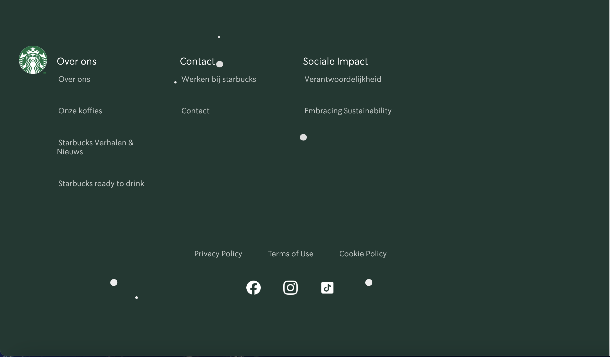
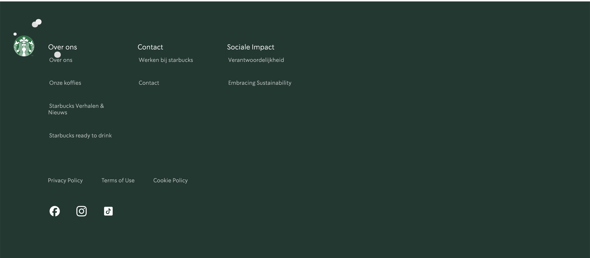
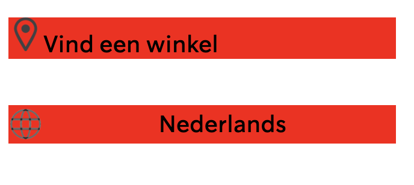
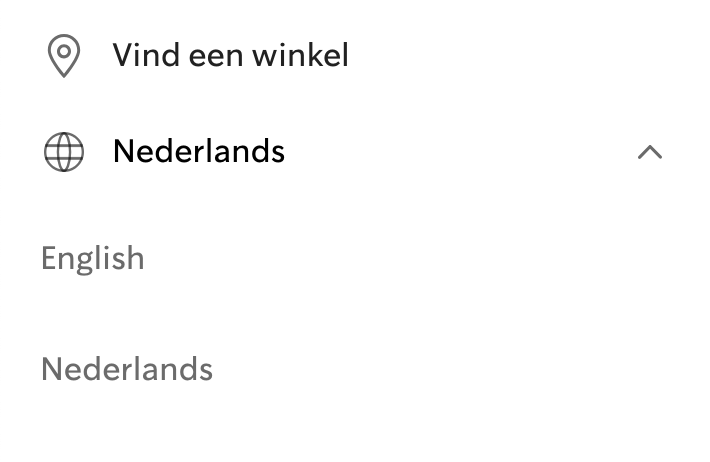

# Procesverslag
Markdown is een simpele manier om HTML te schrijven.  
Markdown cheat cheet: [Hulp bij het schrijven van Markdown](https://github.com/adam-p/markdown-here/wiki/Markdown-Cheatsheet).

Nb. De standaardstructuur en de spartaanse opmaak van de README.md zijn helemaal prima. Het gaat om de inhoud van je procesverslag. Besteedt de tijd voor pracht en praal aan je website.

Nb. Door *open* toe te voegen aan een *details* element kun je deze standaard open zetten. Fijn om dat steeds voor de relevante stuk(ken) te doen.

## Jij

  
uitwerken voor kick-off werkgroep

  ### Auteur:
  Naimah sambo

  #### Je startniveau:
 Ik zit in de blauwe piste, maar ik vind het vormgeven van een website enorm leuk. Zodra ik iets kan doen op het gebied van design, wordt het proces voor mij meteen veel fijner.

  #### Je focus:
 Ik denk toch responsive en service laag. Als ik goed begrijp wat met service laag bedoelt wordt is het de vormgeving en de look van de website. Dat vind ik belangrijk.

 note: ben uiteindelijk toch geswitched naar responsive, met een tikkeltje service plane (kerst-thema)

## Je website

  
uitwerken voor kick-off werkgroep

  ### Je opdracht:
  https://www.starbucks.com

  #### Screenshot(s) van de eerste pagina (small screen): 
  hier de naam van de pagina  
  

  #### Screenshot(s) van de tweede pagina (small screen):
  hier de naam van de pagina  
  
 

## Toegankelijkheidstest 1/2 (week 1)

  
uitwerken na test in 2e werkgroep

  ### Bevindingen screenreader
  Lijst met je bevindingen die in de test naar voren kwamen:
  -Headings worden goed gelezen door de screenreader.
  -Links moeten betere namen krijgen vooral op de home pagina, er staat nu bijvoorbeeld een button met "zie meer" maar van wat?

   ### Bevindingen WCAG
  Lijst met je bevindingen die in de test naar voren kwamen:

  -Content: op de homepagina zijn de buttons en links niet uniek.

  -Global code: Enorm veel errors in HTML, en geen duidelijke titles per pagina. De taal veranderd wel mee met de pagina:
  
  

  -Keyboard: Het is niet duidelijk genoeg waar de focus op staat door kleur contrast:

  -Mobile and touch: De website is extreem goed voor mobiel gebruik, en gebruikt grote duidelijke knoppen met genoeg afstand: 
  

  -Headings: De website maakt gebruik van headings in een duidelijke volgordere, volgends de regels en zonder een heading level te skippen.

  -Lists: De website maakt regelmatig gebruik van list items.

  -Images: Er zijn geen images zonder doel op deze website, maar maakt wel gebruikt van een alt bij img's. Alleen klopt deze alt niet altijd zoals bij het plaatje van de redvelvet latte waar "holliday campain" staat: 
  

  -Media: De website heeft geen Videos of audios.

  -Controls: Er wordt vrijwel altijd gebruik gebruik gemaakt van een a element bij een link, deze zijn dan ook te herkennen als link. Er wordt zelden gebruik gemaakt van een button element voor een button dit gebruikt maar bij één button op de homepagina: 
   

  De links openen dan ook niet op een ander tablat.
  -Appearance: Darkmode wordt niet gesupport op de website. Ook kan de text niet groter dan het standaard formaat.

  -Animation: Er zijn bijna geen animations op de website, alleen kleine subtiele dingen zoals het uitklappen van het hamburger menu wat geleidelijk gaat. 

  -Color contrast: Er is een duidelijk verschil tussen achtergrond en tekst op de website, op een donkere achtergrond wordt bijvoorbeeld gebruik gemaakt van witte tekst en andersom:
hfbbhjebhjbrbfhjbef

   

## Breakdownschets (week 1)

  
uitwerken na afloop 3e werkgroep

  ### de hele pagina: 
  

## Voortgang 1 (week 2)

  
uitwerken voor 1 voortgang

  ### Stand van zaken
  Tijdens het maken van de opzet van mijn website gingen er veel dingen goed: het werken met flexbox, omdat nog vers in mijn geheugen zat. Het stylen van de header ging ook erg goed.
  
   
  
  En het werken met de :root (het kleuren pallet) ging ook heel goed
  
  

  Wat minder goed ging is het verplaatsen van de elementen van de zijkant af.
  
  

  Ook vond ik het lastig om te werken met grid. Het omdraaien van de elementen in de sections vond ik enorm lastig ik heb er uiteindelijk wel iets voor gevonden.

  

  ### Agenda voor meeting
  samen met je groepje opstellen

  | Daniel     | Jasmijn         | Naimah    |
  | ---            | ---                | ---         |
  |elemente overlappen |- elementen footer  | - HTML en CSS checken.   
  |nested grid of flex | h2 boven de h1 hoe?| - Uitleg over de ruimte tussen elementen
  |position relative   | bij testen wel px? | - Uitleg over wanneer grid of flexbox

  ### Verslag van meeting
  hier na afloop snel de uitkomsten van de meeting vastleggen

  - geleerd over meerdere fontfaces toevoegen.
  - geleerd over grid 
  - geleerd over een caro met pijltjes
  - geleerd dat ik voor bepaalde dingen wel margin en padding mag gebruiken.

## Voortgang 2 (week 3)

  
uitwerken voor 2e voortgang

  ### Stand van zaken
Wat ging goed: ik heb geleerd hoe ik grid moet gebruiken op de juiste manier, en dit heb toegepast op de gehele website. Het gebruiken van margin op de website ging ook heel goed. Wat ik fijn vond is het werken met de verschillende style sheets hierdoor blijft de code voor mij overzichtelijk.
 
 
Ik vond het fijn om in CodePen eerst een simpele layout te maken en die daarna toe te passen in VS Code. Ik ben eerst gaan experimenteren met de elementen die ik had: een img, a, p en h2. Daarna heb ik deze elementen in een grid gezet. Dit heeft me uiteindelijk geholpen om het grid voor de main pagina te maken.
 

Wat ging minder goed: het toepassen van de light en darkmode vond ik erg lastig. Ook had ik moeite met de padding op de home pagina. De eerste en de tweede section een andere layout geven met de @media vond ik lastg, maar ben er uiteindelijk wel uitgekomen door weer in codepen aan de slag te gaan. Ik zorgde voor de basis elementen zodat ik die weer stijlen ik had hier wel extra hulp bij nodig.

  ### Agenda voor meeting
  samen met je groepje opstellen

  Daniel - Hoe voorkom ik dat elementen overlappen wanneer het scherm te klein wordt? 
- Hoe voorkom ik dat mijn HTML te veel geneste elementen bevat
- Hoe beslis ik wanneer ik een nested grid moet gebruiken in plaats van een grid binnen flex?
- Wat is position: relative
- Hoe zorg ik ervoor dat een hamburger menu verandert naar een navigatie balk
- Hoe verschuif ik mijn text over mijn plaatjes heen? Moet dat met grid?

Jasmijn -  
- Bij grid garden had je vaak dat het een getal te hoog bijvoorbeeld 6 was en dan kwam het in het 5e vakje, is hier een rede voor en is dit altijd? 
- Wat zijn de onderste elementen in mijn footer?
- Mijn navigatie balk komt bij een hover naar boven kan ik dat later nog toevoegen? 
- Hoe zet ik mijn h2 boven bijvoorbeeld mijn h1? 
- Hoe verschuif ik mijn text over mijn plaatjes heen? Moet dat met grid? 
- Mag ik bij testen wel px gebruiken of niet? 
- Willen jullie checken of mijn css tot nu toe goed gaat? 
- Als ik Child 1 neerzet bij h2 pakt hij mijn tweede en derde h2? 
- hoe kan ik het hamburger menu los maken? dat hij niet overal naar toe meebeweegt?

Naimah - 

- Hoe krijg ik alleen de eerste section zonder padding aan de zijkant?
- Hoe verander ik van font per element?
- Hoe krijg ik de img naar de zijkant van de section met @media?
- Hoe zorg ik dat er meer padding naast de sections zit als ze naast elkaar staan behalve de eerste en de laatste section.?

  ### Verslag van meeting
  hier na afloop snel de uitkomsten van de meeting vastleggen

  - ik heb geleerd hoe ik de eerste section de hele breedte kan laten in nemen
  - ik heb geleerd ik mijn sections responsive kan maken
  - ik heb geleerd dat padding op de main niet de oplossing is voor mijn probleem
- ...

## Toegankelijkheidstest 2/2 (week 4)

-Headings worden goed gelezen door de screenreader.

  -Links hebben betere namen gekregen, je weet nu doormiddel van de aria label waar je op klikt. Eerder was dit een "ontdek meer" nu een "Ontdek meer over de Starbucks geschiedenis".

  -Keyboard: Het is nu wel duidelijk genoeg waar de focus op staat door kleur contrast de focus heeft een duidelijke rode kleur inplaats van het licht groenen

  -Mobile and touch: De website is nogsteeds  goed voor mobiel gebruik, en gebruikt grote duidelijke knoppen met genoeg afstand: 

  -Headings: De website maakt nogsteeds gebruik van headings in een duidelijke volgordere, volgends de regels en zonder een heading level te skippen.

  -Lists: De website maakt altijd gebruik van list items.

  -Images: Maakt wel gebruikt van een alt bij img's, en alle alts kloppen nu wel. Eerder waren er alts zonder goede betekenis, dat is nu niet het geval. : 

  -Media: De website heeft geen Videos of audios.

  -Controls: Er wordt nu altijd gebruik gemaakt van een a element bij een link, deze zijn dan ook te herkennen als link.

  -Appearance: Darkmode nu wel gesupport op de website.

## Voortgang 3 (week 4)

  
uitwerken voor 3e voortgang

  ### Stand van zaken
  wat ging goed: Ik ben er deze week helemaal uitgekomen met het maken van de light en dark-mode en in mijn geval het kerst thema. Ik heb inplaatst van light-dark een @media gebruikt om te veranderen van kleuren in darkmode. Dit heeft me zoveel geholpen omdat ik nu veel meer controle heb over de kleuren in darkmode:

  

  Betere namen gegeven aan mijn kleuren eerder was het "color-text-black" dat heb ik veranderd in "text-primary" omdat ik alleen kleuren in mijn root heb staan was het niet nodig om daar "color" voor te zetten. Ik ben hier erg trots op.

  

  Bij het kerst thema heb ik vallende sneeuwvlokken toegevoegd waar ik heel blij mee ben. Dit maakt het kerst thema helemaal af. 
  
  

  Wat ging minder: Gedurende de week heb ik veel moeite gehad met: het maken van de footer, en het hamburger menu. 
  Voor het hamburger menu heb ik uiteindelijk de bron:<!--https://codepen.io/shooft/pen/NPGXJGq --> gebruikt om een beetje op weg te komen met javascript wat ik al lastig vind. 
  
  Voor de footer ben ik begonnen met het schetsen van de layout. Ik heb gemerkt hoe fijn dit kan zijn vooral als je werkt met grid. Het heeft me geholen om een opzet te maken in codepen:

  
  

  Ik heb nog wel veel vragen over de footer en summary die ik daarin moet gebruiken. 
  

  ### Agenda voor meeting
  samen met je groepje opstellen

Daniel: 
- mijn light & dark mode werkt niet, hoe fix ik dat?
- hoe kan ik de opmaak van mijn footer verbeteren?
- hoe voeg ik icoontjes toe in de header?
- hoe en wat voor beschrijving moet je hebben voor de screenreader
 
Jasmijn: 
- hoe kan ik extra icoontjes en navs toevoegen in header grootscherm
- hoe kan ik er voor zorgen dag ik niet m’n page opnieuw moet reloaden om andere video’s te krijgen bij groot scherm
- er zit een soort streeep onder m’n header, hoe krijg ik die weg

Naimah:
- Hoe zet ik de sneeuw uit bij light-mode.
- Welke selector gebruik ik om ruimte te geven tussen de summary.
- Hoe zet ik de pijltjes naar de andere kant (summary).
- hoe zet ik een a of tekst over mijn afbeelding?
- is het beter om footer nav, header nav enz te gebruiken of nav:nth-of-type
- wat is de juiste selector voor mijn sticky nav?

  ### Verslag van meeting
  hier na afloop snel de uitkomsten van de meeting vastleggen

  - Ik heb geleerd hoe ik de kleur van de summarry pijltjes an aanpassen en stijlen
  - Ik heb geleerd hoe ik de pijltjes verplaats in de summarry
  - Ik heb geleerd dat ik een background image kan gebruiken voor mijn tweede pagina.

## Eindgesprek (week 5)

  
uitwerken voor eindgesprek

  ### Je uitkomst - karakteristiek screenshots:

  pagina 1: 
    
  
  pagina 1: 
    

  ### Dit ging goed/Heb ik geleerd: 
  Wat goed ging was de footer, ondanks ik de footer een lang heb uitgesteld ben ik trots op hoe hij is geworden. Ik heb 4 varianten van mijn footers op verschillende breedtes.

  
  
  
  

  Ik ben ook erg trots op mijn tweede pagina en hoe hij eruit ziet op verschillende formaten. Ik ben hier enorm lang mee bezig geweest,en vond het erg lastig. Maar uiteindelijk door weer te schetsen en te testen in codepen is het mij gelukt.

  

  Ik heb ENORM veel geleerd over grid, en hoe belangrijk schetsen is daarvoor!!!

  ### Dit was lastig/Is niet gelukt:

  Wat helemaal niet goed ging is de header/hambuger menu. Ik heb een hamburger menu kunnen maken die uitschuift, alleen de summary's die daarin zitten is mij helaas niet gelukt om te maken. Ook de brede header was een uitdaging daar zat een summary voor de taal en "meer" button in, dat is mij helaas ook niet gelukt.

  Dit was mijn hamburger menu:
  

  Dit is die van starbucks: 
   
   
  Ik probeerde ook een header animatie toe te voegen maar daardoor ging mijn hele site stuk!

## Bronnenlijst

  
continu bijhouden terwijl je werkt

  Nb. Wees specifiek ('css-tricks' als bron is bijv. niet specifiek genoeg). 
  Nb. ChatGpT en andere AI horen er ook bij.
  Nb. Vermeld de bronnen ook in je code.

- https://codepen.io/shooft/pen/XJmEOyb flex box tekst onder plaatje.
- chatgpt.com Hoe maak ik een link in een stuk tekst. 
- https://dev.to/daaahailey/css-basic-8-hover-active-focus-4d78 Button state
- https://www.w3schools.com/cssref/pr_text_text-transform.php - hoe maak ik text uppercase in css.
- https://gist.github.com/zastrow/bb43d2b256d52738e0ffdee7f825e79f  - hoe haal ik preset styling van een button weg.
- Chatgpt.com -Hoe fix ik de extra ruimte als ik het html element inspecteer? 

